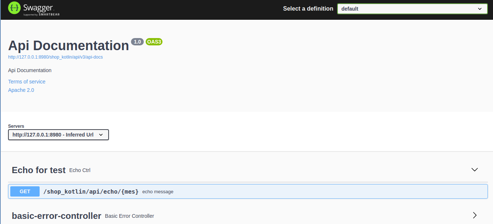
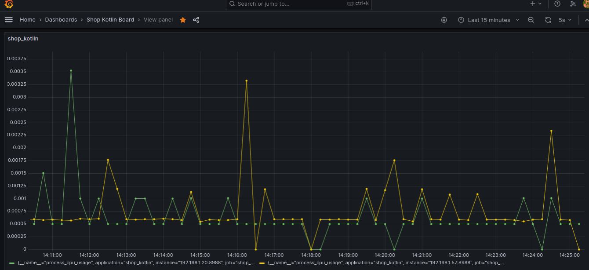
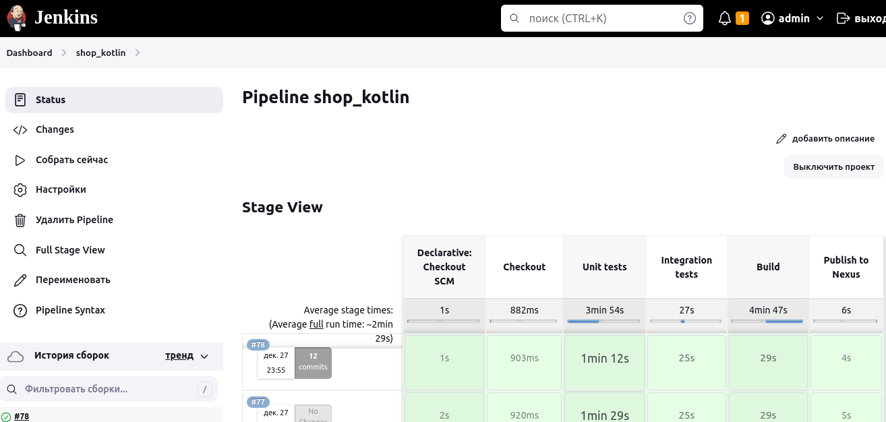
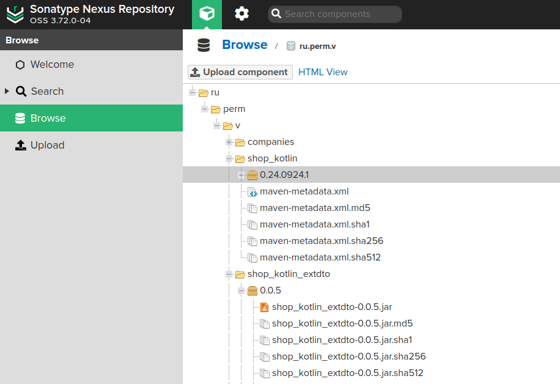

## Простой проект на kotlin и Spring Boot

### Оглавление:
[Цель](#target)<br/>

[Статический анализатор Idea Analize](#static_analize)<br/>
[Статический анализатор SonarCube](#sonarcube)<br/>

[Unit тестирование](#unit_test)<br/>
[Покрытие тестами](#coverage_test)<br/>
[Тестовый запуск](#run)<br/>

[Создание запускаемого файла и его запуск](#create_runable)<br/>

[Интеграционное тестирование](#integration_test_local)<br/>
[Примеры тестов httpie](#httpie)<br/>
[DataJpa tests](#datajpatest_test)<br/>
[RestAssured tests](#restassured)<br/>
[Нагрузочное тестирование](https://github.com/cherepakhin/shop_kotlin_yandex_tank_test)<br/>

[Swagger](#swagger)<br/>
[Spring Actuator](#spring_actuator)<br/>

[Prometheus](#prometheus)<br/>
[Пример просмотра использования CPU в Prometheus](#show_cpu_prometheus)<br/>
[Запуск prometheus в docker](#prometheus_docker)<br/>

[Docker](#docker)<br/>
[Grafana](#grafana)<br/>
[Кеширование](#cache)<br/>
[Сборка Jenkins](#jenkins)<br/>
[Nexus](#nexus)<br/>

[Просмотр ресурсов с помощью Java Mission Control](#jmc)<br/>
[Логирование](#logging)<br/>
[Spring профили](#profiles)<br/>

[Использование "ChatGPT-EasyCode" в VSCode](#chatgpt)<br/>

[TODO](#todo)<br/>
[Примечания](#tose)<br/>
[Ссылки](#links)<br/>

<a id="target"></a>
### Цель

Cоздать небольшое приложение на <b>Kotlin</b> с использованием <b>Spring Boot</b>. Справочник товаров со следующими типами:
<ul>
<li>Настольные компьютеры</li>
<li>Ноутбуки</li>
<li>Мониторы</li>
<li>Жесткие диски</li>
</ul>
Каждый товар имеет следующие свойства:
<ul>
<li>номер серии</li>
<li>производитель</li>
<li>цена</li>
<li>количество единиц продукции на складе</li>
</ul>

Дополнительные свойства:
<ul>
<li>Настольные компьютеры имеют форм-фактор: десктопы, неттопы, моноблоки</li>
<li>Ноутбуки подразделяются по размеру: 13, 14, 15, 17 дюймовые</li>
<li>Мониторы имеют диагональ</li>
<li>Жесткие диски имеют объем</li>
</ul>
   Необходимо реализовать back-end приложение, которое имеет RESTful HTTP методы
   выполняющие:
<ul>
<li>Добавление товара</li>
<li>Редактирование товара</li>
<li>Просмотр всех существующих товаров по типу</li>
<li>Просмотр товара по идентификатору</li>
</ul>
В качестве базы данных использовать in memory database, например H2.

<a id="static_analize"></a>
### Статический анализатор Idea Analize

Проверка кода. Вызывается из контекстного меню Analize - Inspect Code.

<a id="sonarcube"></a>
### Статический анализатор SonarCube

[https://github.com/cherepakhin/shop_kotlin/blob/dev/doc/sonarqube/use_sonarcube.md](https://github.com/cherepakhin/shop_kotlin/blob/dev/doc/sonarqube/use_sonarcube.md)

<a id="unit_test"></a>
### Unit тестирование

````shell
./gradlew test
````

Примеры отбора тестов:

````shell
./gradlew test --tests '*EntityTest'
./gradlew test --tests '*Rest*'
./gradlew test --tests ProductDTOTest
./gradlew test --tests '*TestIntegration'
./gradlew test --tests '*MockMvcTest'
````

<a id="integration_test_local"></a>
### Интеграционное тестирование в проекте

Вообще, интеграционные тесты должны быть в отдельном проекте (см. [https://github.com/cherepakhin/shop_kotlin_restassured_test](https://github.com/cherepakhin/shop_kotlin_restassured_test)). В этом проекте оставил только тесты работы с базой данных. Имена интеграционных тестов должны заканчиваться ..TestIntegration. Прогнать все, кроме интеграционных (включены только *Test, исключены *TestIntegration):

````shell
./gradlew clean test --tests *Test

````

Только интеграционные:

````shell
./gradlew clean test --tests *TestIntegration*
./gradlew clean test --tests *TestIntegration
````

Другие примеры:

````shell
gradle test --tests org.gradle.SomeTest.someSpecificFeature
gradle test --tests *SomeTest.someSpecificFeature
gradle test --tests *SomeSpecificTest
gradle test --tests all.in.specific.package*
gradle test --tests *IntegTest
gradle test --tests *IntegTest*ui*
gradle test --tests *IntegTest.singleMethod
gradle someTestTask --tests *UiTest someOtherTestTask --tests *WebTest*ui
````

Включено протоколирование тестов build.gradle.kts:

````xml
...
tasks.withType<Test> {
    ...
    // Show test log
    testLogging {
        events("passed", "skipped", "failed")
    }
    ...
}
````

Вывод в консоль:

````text
...
ProductServiceImplMockTest > getByGroupProductN() PASSED
ProductServiceIntegrationTest > existByN() PASSED
ProductServiceIntegrationTest > notExistByN() PASSED
ProductServiceIntegrationTest > checkSortByName_ByDslFilterByName() PASSED
...
````

с events("standardOut", "started", "passed", "skipped", "failed") логируется вывод в консоль.

<a id="coverage_test"></a>
### Покрытие тестами

Использован [jacoco](https://www.eclemma.org/jacoco/). Отчет формируется при прогоне тестов

````shell
./gradlew test jacocoTestReport
````

Отчет будет в папке build/reports/jacoco/test/html. В отчете **НЕТ** информации о результатах тестирования, только протестирован участок кода или нет.


Пример отчета по конкретному классу:


<span style="background-color: red">Красным</span> или <span style="background-color:yellow">желтым</span> выделены непротестированные участки кода, зеленым <span style="background-color:green">протестировано</span>.

<a id="run"></a>
### Тестовый запуск

запуск:

````shell
./gradlew bootRun
````

<a id="create_runable"></a>
### Создание запускаемого файла и его запуск

Создание:

````shell
./gradlew bootJar
````
(**bootJar** не **bootRun!!!**)

Собранный файл будет в папке **./build/libs/**

запуск:

````shell
shop_kotlin/$ java -jar build/libs/shop_kotlin-0.1.20.jar
````

или так:

````shell
cd shop_kotlin/build/libs 
shop_kotlin/build/libs$ java -jar shop_kotlin-0.1.20.jar
````

<a id="httpie"></a>
### Примеры тестов [httpie](https://httpie.io/)

Echo запрос для простой проверки работоспособности (:8980/shop_kotlin/ базовый путь проекта):

````shell
http :8980/shop_kotlin/api/echo/aaa

HTTP/1.1 200 
Connection: keep-alive
Content-Length: 3
Content-Type: text/plain;charset=UTF-8
Date: Thu, 15 Jun 2023 07:30:38 GMT
Keep-Alive: timeout=60

aaa 
````

Поиск по имени Product:

````shell
http :8980/shop_kotlin/api/group_product/find?name='Comp'

[
    {
        "haveChilds": true,
        "id": 2,
        "name": "Computers",
        "parentId": 1
    },
    {
        "haveChilds": false,
        "id": 3,
        "name": "Desktop Computers",
        "parentId": 2
    }
````
POST запрос на изменение Product:

````shell
http POST :8980/shop_kotlin/api/product/ < ./src/test/json_test/product.json
````

<a id="integration_test"></a>
### Интеграционное тестирование
Два варианта тестирование - c Spring @DataJpaTest и через RestAssured (это bdd тестирование). Совершенно разные тесты, для совершенно разных целей. DataJpaTest на уровне БД, RestAssured - сквозное тестирование от rest до БД.

<a id="datajpatest_test"></a>
#### DataJpaTest

Тестируется работа с базой данных с использованием [@DataJpaTest](https://www.baeldung.com/kotlin/spring-boot-testing#1-test-repository-using-datajpatest). Находятся в пакете [ru.perm.v.shopkotlin.datajpatest](src/test/kotlin/ru/perm/v/shopkotlin/datajpatest).

<a id="restassured"></a>
#### RestAssured
Для этих тестов сделан отдельный проект [https://github.com/cherepakhin/shop_kotlin_reastassured_test](https://github.com/cherepakhin/shop_kotlin_reastassured_test) 

Результат тестов:


<a id="docker"></a>
### Docker

[Dockerfile](Dockerfile)

Работа с Docker:

```shell
# create docker image
$./docker_build.sh

# run app
$ docker run -p 8080:8980 shop_kotlin/app

$ docker ps
CONTAINER ID   IMAGE             COMMAND                CREATED          STATUS          PORTS                    NAMES
c70ef82f3a54   shop_kotlin/app   "java -jar /app.jar"   43 seconds ago   Up 42 seconds   0.0.0.0:8080->8980/tcp   inspiring_germain

# simple test
$ http :8080/api/group_product/find?name='Comp'

# stop docker app
$docker stop c70

# clear images
$docker image prune -a

# clear all
$docker system prune -af
````

#### ИЛИ средствами gradle:

Создание docker image:

````shell
./gradlew bootBuildImage

...

    [creator]     Saving docker.io/library/shop_kotlin:0.1.18...
    [creator]     *** Images (f80a4e623a3d):
    [creator]           docker.io/library/shop_kotlin:0.1.18
Successfully built image 'docker.io/library/shop_kotlin:0.1.18'
...

````

Запуск docker image:

````shell
$ docker run -p 8980:8980 -p 8988:8988  docker.io/library/shop_kotlin:0.1.18

````
(8980 - основной порт, 8988 - spring actuator)

````shell
$ docker container ls
CONTAINER ID   IMAGE                COMMAND              CREATED          STATUS          PORTS                    NAMES
6544af7b0adb   shop_kotlin:0.1.18   "/cnb/process/web"   12 seconds ago   Up 11 seconds   0.0.0.0:8980->8980/tcp   brave_sutherland

````

Проверка:

````shell
$ http http://127.0.0.1:8980/shop_kotlin/api/echo/aaa

HTTP/1.1 200 
Connection: keep-alive
Content-Length: 3
Content-Type: text/plain;charset=UTF-8
Date: Thu, 30 Nov 2023 15:36:25 GMT
Keep-Alive: timeout=60
Vary: Origin
Vary: Access-Control-Request-Method
Vary: Access-Control-Request-Headers

aaa

````

<a id="swagger"></a>
### Swagger

Swagger доступен по адресу [http://127.0.0.1:8980/shop_kotlin/api/swagger-ui/](http://127.0.0.1:8980/shop_kotlin/api/swagger-ui/) 



<a id="spring_actuator"></a>
### Spring Actuator

Spring Actuator предназначен для получения информации о работающем приложении - статус приложения (жив/нет),  использовании памяти, cpu и т.п.. Поключен по адресу [http://127.0.0.1:8788/api/actuator](http://127.0.0.1:8788/api/actuator)


<a id="prometheus"></a>
### Prometheus

На моем сервере запущен Prometheus. В Prometheus __ОПРАШИВАЕТ__ приложение, согласно заданию (ниже yaml), и собирает метрики (metrics_path+targets). Пример задания для опроса в файле [doc/prometheus/prometheus.yml](https://github.com/cherepakhin/shop_kotlin/doc/prometheus/prometheus.yml). Содержимое [doc/prometheus/prometheus.yml](https://github.com/cherepakhin/shop_kotlin/doc/prometheus/prometheus.yml) поместить в настройки prometheus. Пример задания: 

````yaml
scrape_configs:
- job_name: 'spring boot scrape'
  metrics_path: '/api/actuator/prometheus'
  scrape_interval: 5s
  static_configs:
    - targets: ['192.168.1.20:8988']

````

Опрашивать '192.168.1.20:8988/api/actuator/prometheus' каждые 5 сек.

Для просмотра получаемых prometheus-ом метрик можно выполнить:

````shell
$ http http://127.0.0.1:8788/api/actuator/prometheus**
````
(Использован [httpie](https://httpie.io/))

Ответ:

````
# HELP jvm_threads_daemon_threads The current number of live daemon threads
# TYPE jvm_threads_daemon_threads gauge
jvm_threads_daemon_threads 13.0
# HELP hikaricp_connections Total connections
...
````

Подключение к Prometheus из браузера:
[http://192.168.1.20:9090/targets](http://192.168.1.20:9090/targets)

[http://192.168.1.20:9090/graph](http://192.168.1.20:9090/graph)

Основной экран:
192.168.1.20 - адрес хоста с prometheus
http://192.168.1.20:9090/targets


Меню: Status/Targets


Приложение остановлено:


Приложение запущено:


<a id="show_cpu_prometheus"></a>
### Пример просмотра использования CPU в Prometheus:

Prometheus запущен на 192.168.1.20:9090

Перейти на [http://192.168.1.20:9090](http://192.168.1.20:9090)
В меню "Graph":
1) В "Expression" ввести system_cpu_usage
2) Перейти на Graph
3) Отрегулировать период (н.п. 15 мин.)

Итоговый запрос: [http://192.168.1.20:9090/graph?g0.range_input=15m&g0.expr=system_cpu_usage&g0.tab=0](http://192.168.1.20:9090/graph?g0.range_input=15m&g0.expr=system_cpu_usage&g0.tab=0)


<a id="prometheus_docker"></a>
#### Запуск prometheus в docker:

```shell
docker run -d -p 9090:9090 -v "/$(pwd)/for_prometheus/prometheus.yml":/etc/prometheus/prometheus.yml prom/prometheus
```

Просмотр состояния prometheus, запущенного в docker:

Вычисление ID container

````shell
>docker ps
CONTAINER ID   IMAGE             COMMAND                  CREATED         STATUS         PORTS                    NAMES
e081bb1f500c   prom/prometheus   "/bin/prometheus --c…"   4 minutes ago   Up 4 minutes   0.0.0.0:9090->9090/tcp   reverent_newton
````

Просмотр логов контейнера prometheus (e08 id контейнера)

````shell
docker logs e08 --follow
````

Выхлоп:
````
...
ts=2023-09-11T13:13:17.850Z caller=main.go:1009 level=info msg="Server is ready to receive web requests."
ts=2023-09-11T13:13:17.850Z caller=manager.go:1009 level=info component="rule manager" msg="Starting rule manager..."
````


<a id="grafana"></a>
### Grafana
Graphana отображает метрики, собранные Prometheus. На домашнем сервере развернута Grafana:




Запуск grafana:

````shell
vasi@v$ sudo service grafana-server start
````

Остановка grafana:

````shell
vasi@v$ sudo service grafana-server stop
````

[Пример запроса](http://192.168.1.20:3000/explore?orgId=1&left=%7B%22datasource%22:%22grafana%22,%22queries%22:%5B%7B%22queryType%22:%22randomWalk%22,%22refId%22:%22A%22,%22datasource%22:%7B%22type%22:%22datasource%22,%22uid%22:%22grafana%22%7D%7D%5D,%22range%22:%7B%22from%22:%22now-6h%22,%22to%22:%22now%22%7D%7D)

user(pass): admin/admin

<a id="swagger"></a>
### Swagger

Адрес [http://127.0.0.1:8780/api/swagger-ui/](http://127.0.0.1:8780/api/swagger-ui/)


<a id="cache"></a>
### Кеширование

Кеширование сделано для RestController:

````kotlin
@GetMapping("/")
@Cacheable("allGroupProductDTO")
@ApiOperation("Get all groups of product")
fun all(): List<GroupProductDTO> {
    ...
}
````

Использован [org.springframework.cache](https://spring-projects.ru/guides/caching/). Ручная проверка работы кеш:

```shell
# Очистка кеша
$http :8780/api/group_product/clear_cache
# Для проверки, несколько раз сделать get запрос. 
# При этом в лог будет только один запрос к репозиторию.
$http :8780/api/group_product/

```

<a id="jenkins"></a>
### Сборка Jenkins

Сборка происходит в Jenkins, развернутом на домашнем сервере. Pipeline для Jenkins описан в файле [./Jenkinsfile](Jenkinsfile)



> Установка и настройка домашнего Jenkins описана в [http://v.perm.ru/main/index.php/50-organizatsiya-sobstvennogo-ci-cd](http://v.perm.ru/main/index.php/50-organizatsiya-sobstvennogo-ci-cd)

В проекте используется внешняя зависимость из домашнего NEXUS репозитория [https://github.com/cherepakhin/shop_kotlin_extdto](https://github.com/cherepakhin/shop_kotlin_extdto):

````shell
implementation("ru.perm.v:shop_kotlin_extdto:0.0.3")
````

<a id="nexus"></a>
### Deploy to NEXUS repository

Возможен с использованием Jenkins (описано выше) или ручной deploy в Nexus с личного компьютера.

Для deploy выполнить:

````shell
./gradlew publish
````

Путь к репозиторию установлен в build.gradle.kts:

````shell
url = uri("http://v.perm.ru:8082/repository/ru.perm.v/")
````

Для установки переменных доступа к Nexus repository выполнить в shell:

````shell
$ export NEXUS_CRED_USR=admin
$ export NEXUS_CRED_PSW=pass
````



<a id="jms"></a>
### Просмотр ресурсов с помощью Java Mission Control

[Java Mission Control](https://www.oracle.com/cis/javase/jmc/)

````shell
jmc-8.3.1_linux-x64/JDK Mission Control$ jmc
````


<a id="logging"></a>
### Логирование

Настройка сделана в application.yaml:

````yaml
logging:
  level:
    root: info
  file:
    path: log/
````

<a id="profiles"></a>
### Profiles

Описание profiles в application.yaml [https://habr.com/ru/companies/otus/articles/576910/](https://habr.com/ru/companies/otus/articles/576910/)

````yaml
spring:
  profiles:
    active:
      - local
---
# profile specific properties

spring:
  profiles: local

  datasource:
    url: jdbc:mysql://localhost:3306/
    username: root
    password: root

---
# profile specific properties

spring:
  profiles: dev

  datasource:
    url: jdbc:mysql://<dev db url>
    username: <username>
    password: <password>
````

Запуск с указанием профиля:

````shell
java -D"spring.profiles.active=dev" -jar app.jar
````

или установить env переменную:

```shell
SPRING_PROFILES_ACTIVE = dev
```

Запуск с maven:

```shell
./mvnw spring-boot:run -Dspring-boot.run.profiles=dev
```

Запуск с gradle:

````shell
$ ./gradlew bootRun --args='--spring.profiles.active=dev'
````

или

````shell
SPRING_PROFILES_ACTIVE=test ./gradlew clean bootRun
````

<a id="chagpt"></a>
### Использование "ChatGPT-EasyCode" в VSCode

Генерация тестов


Рефакторинг


МОЖЕТ-БЫТЬ эпизодически и возможно использовать.


<a id="todo"></a>
### TODO

- ~~cache on rest (сделано)~~
- ~~RestAssured tests (сделано)~~ (https://github.com/cherepakhin/shop_kotlin_reastassured_test)
- ~~by lazy (сделано)~~
- ~~Docker (сделано)~~
- ~~Swagger (сделано)~~
- ~~Actuator (сделано)~~
- ~~flyway (использована БД в памяти url: jdbc:h2:mem:easybotdb). Миграции не требуются.~~
- webmvc тесты (ProductRestMockMvcTest)
- ~~тесты service слоя с СУБД @DataJpaTest (сделано)~~
- вертикальные БД (?)
- ~~Различные SQL запросы через native Sql и Spring JPA(order by, group by) (сделано)~~
- Pagination
- ~~Grafana (сделано)~~
- ElasticSearch
- Авторизация

<a id="tose"></a>
### Примечания:

В программе не используются слои controller и service, т.к. проект сделан только для демонстрации Kotlin, и не планируется какая-либо бизнес-логика. Конвертация в DTO сделана в REST контроллерах.

Поля в **entity** классах д.б. обозначены **"open"** (н.п. **open** val name: String = "").  В Kotlin используется следующий подход - можно наследовать от суперклассов и переопределять их свойства и функции только в том случае, если они снабжены префиксом **"open"**.

Имя для "id" поля в entity классах названы "n". Причины: 
- В некоторых БД "id" ключевое слово
- В interface repository есть отдельные методы repository.getById(), repository.findById(). Имеется ввиду поиск по primary key. Это путает.

Правила использования модификатора **lateinit**:
- используется только совместно с ключевым словом var;
- свойство может быть объявлено только внутри тела класса (не в основном конструкторе);
- тип свойства не может быть нулевым и примитивным;
- у свойства не должно быть пользовательских геттеров и сеттеров;
- с версии Kotlin 1.2 можно применять к свойствам верхнего уровня и локальным переменным.
- сообщает что инициализация будет как-то сделана (в примере ниже аннотациями @Mock, @InjectMocks). @Mock mockProductService будут инжектированы в @InjectMocks productRest. Пример:

````kotlin
internal class ProductRestTest { 
    @Mock
    private lateinit var mockProductService: ProductService

    @InjectMocks
    private lateinit var productRest: ProductRest
    ...
}


````

**byLazy**

````kotlin
val catName: String by lazy { getName() }
````

свойство объявлено как **VAL**, но присвоение будет выполнено при **первом использовании** и потом уже не будет инициализироваться. 

**Ссылки о lazy и lateinit:**
- https://github.com/cherepakhin/kotlin_in_action
- https://developer.alexanderklimov.ru/android/kotlin/lateinit.php
- https://www.baeldung.com/kotlin/lazy-initialization
- https://bimlibik.github.io/posts/kotlin-lateinit-and-lazy/

**Статические члены и компаньон объекты в Kotlin:**

Как правило объекты-компаньоны используются для объявления переменных и функций, к которым требуется обращаться без создания экземпляра класса. Либо для объявления констант. По сути они своего рода замена статическим членам класса (в отличие от Java, в Kotlin нет статики).

- Как бы static:

````kotlin
class Someclass {
  ...
  object AsStaticObject {
    fun create() {
      ...
    }
  }

}

...

val someClass = SomeClass.AsStaticObject.create()
````

- Companion Object (вложенный объект. Метод create() принадлежит родительскому классу):

````kotlin
class SomeClass {

  companion object {
    fun create()
  }
}

...

val someClass = SomeClass.create()
````

**Различия между val и const val в Kotlin**

````kotlin
val MY_VAL = 1
const val MY_CONST_VAL = 2
````

- Обе эти переменные немодифицируемые
- **MY_VAL** станет приватной переменной, для доступа к которой будет создан геттер
- **MY_CONST_VAL** будет заинлайнена, то есть компилятор заменит все полученные значения этой переменной на само значение
- [Kotlin const, var, and val Keywords](https://www.baeldung.com/kotlin/const-var-and-val-keywords)

**Ошибка "ERROR: Cannot resume build because FlowNode 19"**

Ответ тут [https://community.jenkins.io/t/error-cannot-resume-build-because-flownode-19/9477/3](https://community.jenkins.io/t/error-cannot-resume-build-because-flownode-19/9477/3)

В двух словах: добавить в Jenkinsfile "максмальную выживаемость"  

````
...
pipeline {

    agent any
    options {
        durabilityHint 'MAX_SURVIVABILITY'
    }
...
````
- В Windows на сетевом диске компилировалось с проблемами **query-dsl**. После переноса на **диск C:** проблемы ушли.

- Если появилась ошибка: "./gradlew: строка 2: $'\r': команда не найдена", то выполнить: 

````
shop_kotlin$ gradle wrapper
````

Похоже, при расшаривании папки для Windows и работе в Windows изменился символ конца строки. 

- Смена версии gradlew: в ./gragle/wrapper/gradle-wrapper.properties

````
distributionUrl=https\://services.gradle.org/distributions/gradle-7.6.1-bin.zip
````
Тесты проходят (из idea и из shell):

````
./gradlew test
````

<a id="links"></a>
### Ссылки:

[Интеграционное тестирование REST](http://v.perm.ru/main/index.php/34-behave-testirovanie)<br/>
[Настройка и использование Prometheus, Grafana](http://v.perm.ru/main/index.php/64-nastrojka-i-ispolzovanie-prometheus-grafana)<br/>
[Шпаргалка по Docker](http://v.perm.ru/main/index.php/homepage/56-shpargalka-po-docker)<br/>
[Set java version](http://v.perm.ru/main/index.php/homepage/60-set-java-version)<br/>
[Установка и настройка домашнего Nexus/Jenkins](http://v.perm.ru/main/index.php/50-organizatsiya-sobstvennogo-ci-cd)<br/>